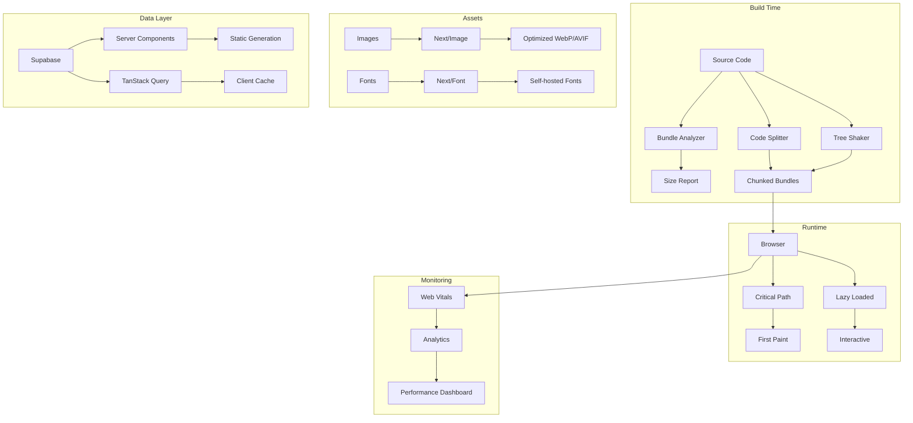

# Design Document: Performance Optimization

## Overview

This design document outlines the comprehensive performance optimization strategy for the Next.js 16 portfolio website. The optimization focuses on reducing bundle sizes, improving load times, enhancing caching strategies, optimizing images and fonts, implementing efficient code splitting, and achieving superior Core Web Vitals metrics while maintaining the existing 100/100 Lighthouse score.

The performance optimization will be implemented through a multi-layered approach:
1. **Build-time optimizations**: Bundle analysis, code splitting, tree-shaking, and compression
2. **Runtime optimizations**: Lazy loading, caching strategies, and efficient data fetching
3. **Asset optimizations**: Image and font loading improvements
4. **Code quality optimizations**: Server Component usage, memoization, and cleanup patterns
5. **Monitoring and measurement**: Core Web Vitals tracking and performance budgets

## Architecture

### High-Level Architecture



### Component Architecture

The performance optimization system is organized into several key areas:

1. **Bundle Optimization Layer**
   - Bundle analyzer integration for size monitoring
   - Dynamic import configuration for code splitting
   - Vendor chunk separation strategy
   - Tree-shaking configuration

2. **Asset Optimization Layer**
   - Image optimization pipeline using Next.js Image
   - Font optimization using next/font
   - Lazy loading strategies for below-the-fold content
   - Resource hints (preconnect, dns-prefetch, preload)

3. **Caching Layer**
   - Static generation with ISR for pages
   - TanStack Query for client-side data caching
   - Next.js unstable_cache for server-side caching
   - HTTP cache headers for static assets

4. **Server/Client Boundary**
   - Server Components for non-interactive content
   - Client Components only where interactivity is needed
   - Streaming SSR with Suspense boundaries
   - Progressive enhancement patterns

5. **Monitoring Layer**
   - Web Vitals measurement (LCP, FID, CLS)
   - Performance budget enforcement
   - Analytics integration for real-user monitoring
   - Build-time size reporting

## Components and Interfaces

### 1. Bundle Analyzer Configuration

**Purpose**: Analyze and visualize JavaScript bundle sizes to identify optimization opportunities.

**Interface**:
```typescript
// next.config.ts
import bundleAnalyzer from '@next/bundle-analyzer';

const withBundleAnalyzer = bundleAnalyzer({
  enabled: process.env.ANALYZE === 'true',
});

export default withBundleAnalyzer(nextConfig);
```

**Key Features**:
- Visual bundle size reports
- Chunk size tracking
- Dependency size analysis
- Historical size comparison

### 2. Image Optimization Component

**Purpose**: Optimize all images using Next.js Image component with proper loading strategies.

**Interface**:
```typescript
import Image from 'next/image';

interface OptimizedImageProps {
  src: string;
  alt: string;
  priority?: boolean; // For above-the-fold images
  fill?: boolean;
  sizes?: string;
  className?: string;
}

// Usage patterns:
// Above-the-fold (hero): priority={true}
// Below-the-fold: loading="lazy" (default)
// Responsive: sizes="(max-width: 768px) 100vw, 50vw"
```

**Optimization Strategy**:
- Automatic WebP/AVIF format conversion
- Responsive image generation with srcset
- Blur placeholder for layout stability
- Lazy loading for below-the-fold images
- Priority loading for critical images

### 3. Font Optimization Configuration

**Purpose**: Self-host and optimize font loading to eliminate external requests and reduce CLS.

**Interface**:
```typescript
// app/layout.tsx
import { Inter, Roboto_Mono } from 'next/font/google';

const inter = Inter({
  subsets: ['latin'],
  display: 'swap',
  variable: '--font-inter',
  preload: true,
});

const robotoMono = Roboto_Mono({
  subsets: ['latin'],
  display: 'swap',
  variable: '--font-roboto-mono',
  weight: ['400', '700'], // Only load needed weights
});
```

**Key Features**:
- Automatic font subsetting
- Self-hosting (no external requests)
- Font-display: swap for immediate text rendering
- Preloading for critical fonts
- CSS variable integration

### 4. Code Splitting Strategy

**Purpose**: Split code into smaller chunks that are loaded on demand.

**Implementation Patterns**:

```typescript
// Dynamic import for heavy components
import dynamic from 'next/dynamic';

const HeavyComponent = dynamic(() => import('./HeavyComponent'), {
  loading: () => <Skeleton />,
  ssr: false, // Client-only if needed
});

// Dynamic import for libraries
const loadFramerMotion = () => import('framer-motion');

// Route-based splitting (automatic in App Router)
// Each page in app/ directory is automatically code-split
```

**Splitting Rules**:
- Components > 50KB: Dynamic import
- Third-party libraries > 50KB: Lazy load on interaction
- Animation libraries: Load only in components that need them
- MDX/Markdown: Load only on blog pages
- Charts/visualizations: Load on demand

### 5. Caching Strategy

**Purpose**: Implement multi-layer caching to minimize redundant data fetching and improve response times.

**Cache Layers**:

```typescript
// 1. Static Generation with ISR
export const revalidate = 60; // Revalidate every 60 seconds

// 2. Server-side caching with unstable_cache
import { unstable_cache } from 'next/cache';

const getCachedData = unstable_cache(
  async () => {
    return await fetchData();
  },
  ['cache-key'],
  { tags: ['data'], revalidate: 60 }
);

// 3. Client-side caching with TanStack Query
const { data } = useQuery({
  queryKey: ['data'],
  queryFn: fetchData,
  staleTime: 5 * 60 * 1000, // 5 minutes
  gcTime: 10 * 60 * 1000, // 10 minutes
});

// 4. HTTP cache headers for static assets
// Automatic in Next.js for /public and /_next/static
```

**Revalidation Strategy**:
- Static pages: 1 hour (3600s)
- Blog posts: 1 minute (60s)
- Projects: 1 hour (3600s)
- GitHub data: 5 minutes (300s)
- Static assets: 1 year (immutable)

### 6. Server Component Optimization

**Purpose**: Maximize use of Server Components to reduce client-side JavaScript.

**Decision Tree**:
```
Does component need interactivity? (useState, useEffect, event handlers)
├─ NO → Server Component (default)
│   ├─ Fetch data directly with async/await
│   ├─ No "use client" directive
│   └─ Zero JavaScript sent to client
│
└─ YES → Client Component
    ├─ Add "use client" directive
    ├─ Keep component small and focused
    └─ Avoid importing heavy libraries
```

**Server Component Patterns**:
```typescript
// Server Component (default)
async function ProjectList() {
  const projects = await getProjects(); // Direct data fetching
  
  return (
    <div>
      {projects.map(project => (
        <ProjectCard key={project.id} project={project} />
      ))}
    </div>
  );
}

// Client Component (only when needed)
'use client';

function InteractiveFilter({ children }) {
  const [filter, setFilter] = useState('all');
  
  return (
    <div>
      <FilterButtons onChange={setFilter} />
      {children}
    </div>
  );
}
```

### 7. Database Query Optimization

**Purpose**: Optimize Supabase queries to reduce response times and data transfer.

**Optimization Patterns**:

```typescript
// ❌ Bad: Select all columns
const { data } = await supabase
  .from('posts')
  .select('*');

// ✅ Good: Select only needed columns
const { data } = await supabase
  .from('posts')
  .select('id, title, slug, published_at');

// ✅ Good: Use joins instead of multiple queries
const { data } = await supabase
  .from('posts')
  .select(`
    id,
    title,
    author:profiles(name, avatar)
  `);

// ✅ Good: Implement pagination
const { data } = await supabase
  .from('posts')
  .select('*')
  .range(0, 19) // First 20 items
  .order('published_at', { ascending: false });
```

**Index Strategy**:
- Index on `slug` columns (unique lookups)
- Index on `published_at` (sorting/filtering)
- Index on `category` (filtering)
- Composite indexes for common query patterns

### 8. Resource Hints

**Purpose**: Proactively establish connections and preload critical resources.

**Implementation**:
```typescript
// app/layout.tsx
export default function RootLayout({ children }) {
  return (
    <html>
      <head>
        {/* Preconnect to external domains */}
        <link rel="preconnect" href="https://supabase.co" />
        <link rel="preconnect" href="https://api.github.com" />
        
        {/* DNS prefetch for additional domains */}
        <link rel="dns-prefetch" href="https://images.unsplash.com" />
        
        {/* Preload critical fonts (handled by next/font) */}
        {/* Preload critical images (use priority prop) */}
      </head>
      <body>{children}</body>
    </html>
  );
}
```

### 9. Animation Performance

**Purpose**: Ensure animations run smoothly at 60fps without causing jank.

**Optimization Patterns**:

```typescript
'use client';

import { motion } from 'framer-motion';
import { useSafeReducedMotion } from '@/hooks/useSafeReducedMotion';

function AnimatedComponent() {
  const shouldReduceMotion = useSafeReducedMotion();
  
  return (
    <motion.div
      // ✅ Use transform and opacity (GPU-accelerated)
      animate={shouldReduceMotion ? {} : {
        opacity: [0, 1],
        transform: ['translateY(20px)', 'translateY(0)'],
      }}
      // ❌ Avoid animating: width, height, top, left (causes reflow)
      
      // Respect user preferences
      transition={{
        duration: shouldReduceMotion ? 0 : 0.5,
      }}
    />
  );
}

// Throttle scroll listeners
import { useEffect } from 'react';

function useThrottledScroll(callback: () => void, delay: number) {
  useEffect(() => {
    let timeoutId: NodeJS.Timeout;
    
    const handleScroll = () => {
      if (timeoutId) return;
      
      timeoutId = setTimeout(() => {
        callback();
        timeoutId = null;
      }, delay);
    };
    
    window.addEventListener('scroll', handleScroll, { passive: true });
    return () => window.removeEventListener('scroll', handleScroll);
  }, [callback, delay]);
}
```

### 10. Third-Party Script Loading

**Purpose**: Load third-party scripts efficiently without blocking page rendering.

**Implementation**:
```typescript
import Script from 'next/script';

function Analytics() {
  return (
    <>
      {/* Critical analytics: afterInteractive */}
      <Script
        src="https://analytics.example.com/script.js"
        strategy="afterInteractive"
      />
      
      {/* Non-critical: lazyOnload */}
      <Script
        src="https://widget.example.com/widget.js"
        strategy="lazyOnload"
      />
    </>
  );
}
```

**Loading Strategies**:
- `beforeInteractive`: Critical scripts (rare)
- `afterInteractive`: Analytics, error tracking
- `lazyOnload`: Widgets, chat, non-critical features
- `worker`: Web Workers (experimental)

### 11. Web Vitals Monitoring

**Purpose**: Measure and report Core Web Vitals to identify performance regressions.

**Implementation**:
```typescript
// app/web-vitals.tsx
'use client';

import { useReportWebVitals } from 'next/web-vitals';

export function WebVitals() {
  useReportWebVitals((metric) => {
    // Send to analytics
    if (typeof window !== 'undefined' && window.gtag) {
      window.gtag('event', metric.name, {
        value: Math.round(metric.value),
        event_label: metric.id,
        non_interaction: true,
      });
    }
    
    // Log warnings for poor metrics
    if (metric.name === 'LCP' && metric.value > 2500) {
      console.warn('LCP exceeds 2.5s:', metric.value);
    }
    if (metric.name === 'CLS' && metric.value > 0.1) {
      console.warn('CLS exceeds 0.1:', metric.value);
    }
    if (metric.name === 'FID' && metric.value > 100) {
      console.warn('FID exceeds 100ms:', metric.value);
    }
  });
  
  return null;
}
```

### 12. Memory Management

**Purpose**: Prevent memory leaks and optimize runtime performance.

**Cleanup Patterns**:

```typescript
'use client';

import { useEffect, useCallback, useMemo } from 'react';

function OptimizedComponent({ data, onUpdate }) {
  // ✅ Memoize expensive computations
  const processedData = useMemo(() => {
    return data.map(item => expensiveTransform(item));
  }, [data]);
  
  // ✅ Memoize callbacks to prevent re-renders
  const handleUpdate = useCallback(() => {
    onUpdate(processedData);
  }, [onUpdate, processedData]);
  
  // ✅ Clean up event listeners
  useEffect(() => {
    const handleResize = () => {
      // Handle resize
    };
    
    window.addEventListener('resize', handleResize);
    return () => window.removeEventListener('resize', handleResize);
  }, []);
  
  // ✅ Clean up timers
  useEffect(() => {
    const timer = setInterval(() => {
      // Do something
    }, 1000);
    
    return () => clearInterval(timer);
  }, []);
  
  return <div>{/* Render */}</div>;
}

// ✅ Memoize components to prevent unnecessary re-renders
export default React.memo(OptimizedComponent);
```

## Data Models

### Performance Budget Model

```typescript
interface PerformanceBudget {
  // Bundle sizes (in KB)
  mainBundle: number;        // Target: < 200KB
  totalJavaScript: number;   // Target: < 500KB
  totalCSS: number;          // Target: < 50KB
  
  // Core Web Vitals
  lcp: number;               // Target: < 2.5s
  fid: number;               // Target: < 100ms
  cls: number;               // Target: < 0.1
  
  // Additional metrics
  ttfb: number;              // Target: < 600ms
  fcp: number;               // Target: < 1.8s
  tti: number;               // Target: < 3.8s
}
```

### Bundle Analysis Model

```typescript
interface BundleAnalysis {
  timestamp: Date;
  totalSize: number;
  chunks: Array<{
    name: string;
    size: number;
    modules: Array<{
      name: string;
      size: number;
    }>;
  }>;
  comparison?: {
    previousSize: number;
    delta: number;
    percentChange: number;
  };
}
```

### Cache Configuration Model

```typescript
interface CacheConfig {
  // Page-level caching
  pages: Record<string, {
    strategy: 'static' | 'isr' | 'ssr';
    revalidate?: number;
  }>;
  
  // Data-level caching
  queries: Record<string, {
    staleTime: number;
    gcTime: number;
    tags?: string[];
  }>;
  
  // Asset caching
  assets: {
    images: { maxAge: number };
    fonts: { maxAge: number };
    scripts: { maxAge: number };
  };
}
```

## Correctness Properties

*A property is a characteristic or behavior that should hold true across all valid executions of a system—essentially, a formal statement about what the system should do. Properties serve as the bridge between human-readable specifications and machine-verifiable correctness guarantees.*

### Property 1: Bundle Size Constraint
*For any* production build, the main JavaScript bundle size should be less than or equal to 200KB.
**Validates: Requirements 1.4**

### Property 2: Image Component Usage
*For any* image rendered in the application, it should use the Next.js Image component rather than standard HTML img tags.
**Validates: Requirements 2.1**

### Property 3: Below-Fold Image Lazy Loading
*For any* image that is not above the fold, it should have lazy loading enabled (loading="lazy" or default behavior).
**Validates: Requirements 2.2**

### Property 4: Critical Image Priority
*For any* above-the-fold image (hero images, logos), it should have the priority prop set to true.
**Validates: Requirements 2.3**

### Property 5: Image Placeholder Prevention
*For any* Next.js Image component, it should include a placeholder (blur, empty, or explicit dimensions) to prevent layout shift.
**Validates: Requirements 2.4**

### Property 6: Image File Size Limit
*For any* image file in the public directory, its file size should be less than or equal to 100KB.
**Validates: Requirements 2.6**

### Property 7: Font Display Strategy
*For any* font configuration using next/font, it should have display: 'swap' to show fallback fonts immediately.
**Validates: Requirements 3.3**

### Property 8: Heavy Component Dynamic Import
*For any* component that imports libraries exceeding 50KB (like Framer Motion, charts), it should use dynamic import.
**Validates: Requirements 4.1, 4.3**

### Property 9: Dynamic Import Suspense Boundary
*For any* dynamic import using React.lazy or next/dynamic, there should be a Suspense boundary with a fallback component.
**Validates: Requirements 4.6**

### Property 10: API Route Cache Headers
*For any* API route handler, it should return appropriate Cache-Control headers.
**Validates: Requirements 5.2**

### Property 11: ISR Page Revalidation
*For any* page using Incremental Static Regeneration, it should export a revalidate constant with an appropriate interval.
**Validates: Requirements 5.3**

### Property 12: TanStack Query Configuration
*For any* Supabase data fetch using TanStack Query, it should have staleTime and gcTime configured.
**Validates: Requirements 5.4**

### Property 13: Dynamic Route Static Params
*For any* dynamic route (e.g., [slug]), it should export a generateStaticParams function for static generation.
**Validates: Requirements 5.7**

### Property 14: Server Component Default
*For any* component that doesn't use client-side hooks (useState, useEffect) or event handlers, it should not have the "use client" directive.
**Validates: Requirements 6.1**

### Property 15: Client Component Directive
*For any* component that uses client-side hooks or event handlers, it should have the "use client" directive.
**Validates: Requirements 6.2**

### Property 16: Server Component Data Fetching
*For any* data fetching that doesn't depend on client state, it should be performed in a Server Component using async/await.
**Validates: Requirements 6.3**

### Property 17: Server Component Library Imports
*For any* Server Component (without "use client"), it should not import client-only libraries like framer-motion or react-hook-form.
**Validates: Requirements 6.4**

### Property 18: Server Component Async Pattern
*For any* Server Component that fetches data, it should use async/await directly without additional data fetching libraries.
**Validates: Requirements 6.6**

### Property 19: Supabase Column Selection
*For any* Supabase query, it should use .select() with specific column names rather than '*' (select all).
**Validates: Requirements 7.1**

### Property 20: Animation GPU Acceleration
*For any* Framer Motion animation, it should primarily use transform and opacity properties for GPU acceleration.
**Validates: Requirements 9.1**

### Property 21: Scroll Event Throttling
*For any* scroll event listener, it should be throttled or debounced to prevent performance issues.
**Validates: Requirements 9.2**

### Property 22: Reduced Motion Support
*For any* component with animations, it should check and respect the prefers-reduced-motion media query.
**Validates: Requirements 9.5**

### Property 23: API Response Compression
*For any* API route returning JSON responses larger than 1KB, it should have compression enabled.
**Validates: Requirements 10.5**

### Property 24: Third-Party Script Strategy
*For any* third-party script loaded using next/script, it should have an appropriate strategy (afterInteractive or lazyOnload).
**Validates: Requirements 12.1, 12.2**

### Property 25: Optional Script Lazy Loading
*For any* non-critical third-party script (widgets, chat), it should use strategy="lazyOnload" or load on user interaction.
**Validates: Requirements 12.5**

### Property 26: API Retry Logic
*For any* external API call (GitHub, Supabase), it should implement retry logic with exponential backoff for failed requests.
**Validates: Requirements 14.6**

### Property 27: Event Listener Cleanup
*For any* component that adds event listeners in useEffect, it should return a cleanup function that removes those listeners.
**Validates: Requirements 15.1**

### Property 28: Timer Cleanup
*For any* component that creates timers (setTimeout, setInterval) in useEffect, it should return a cleanup function that clears those timers.
**Validates: Requirements 15.2**

### Property 29: Large List Virtualization
*For any* list rendering 100 or more items, it should implement virtualization to render only visible items.
**Validates: Requirements 15.3**

### Property 30: Expensive Computation Memoization
*For any* expensive computation or transformation in a component, it should be wrapped in useMemo to prevent unnecessary recalculation.
**Validates: Requirements 15.4**

### Property 31: Callback Memoization
*For any* callback function passed as a prop to child components, it should be wrapped in useCallback to maintain referential equality.
**Validates: Requirements 15.5**

## Error Handling

### Build-Time Errors

1. **Bundle Size Exceeded**
   - Detection: Bundle analyzer reports main bundle > 200KB
   - Handling: Fail build with detailed report of largest modules
   - Recovery: Implement code splitting for identified large modules

2. **Missing Image Optimization**
   - Detection: HTML img tags found instead of Next.js Image
   - Handling: ESLint rule to warn/error on img usage
   - Recovery: Replace with Next.js Image component

3. **TypeScript Compilation Errors**
   - Detection: TypeScript compiler errors during build
   - Handling: Fail build with error details
   - Recovery: Fix type errors (never ignore with ts-ignore)

### Runtime Errors

1. **Image Loading Failures**
   - Detection: Image component onError callback
   - Handling: Display fallback image or placeholder
   - Recovery: Retry with different format or show error state

2. **Data Fetching Failures**
   - Detection: TanStack Query error state
   - Handling: Display error boundary with retry button
   - Recovery: Implement exponential backoff retry logic

3. **Animation Performance Issues**
   - Detection: Frame rate drops below 60fps
   - Handling: Disable or simplify animations
   - Recovery: Use CSS animations instead of JavaScript

4. **Memory Leaks**
   - Detection: Increasing memory usage over time
   - Handling: Log warning and identify leaking component
   - Recovery: Ensure proper cleanup in useEffect

### Performance Degradation

1. **Core Web Vitals Threshold Exceeded**
   - Detection: LCP > 2.5s, FID > 100ms, or CLS > 0.1
   - Handling: Log warning with metric details
   - Recovery: Identify and optimize problematic components

2. **Cache Miss Rate High**
   - Detection: High number of cache misses in analytics
   - Handling: Adjust cache configuration
   - Recovery: Increase staleTime or implement better cache keys

3. **Bundle Size Regression**
   - Detection: Build size increases significantly
   - Handling: Fail CI/CD pipeline with size comparison
   - Recovery: Identify and remove unnecessary dependencies

## Testing Strategy

### Dual Testing Approach

This feature will use both unit tests and property-based tests to ensure comprehensive coverage:

- **Unit tests**: Verify specific examples, edge cases, and configuration correctness
- **Property tests**: Verify universal properties hold across all components and builds

Both types of tests are complementary and necessary for comprehensive performance validation.

### Property-Based Testing

We will use **fast-check** (already in package.json) for property-based testing. Each property test will:
- Run a minimum of 100 iterations to ensure comprehensive coverage
- Be tagged with a comment referencing the design document property
- Test universal properties across all valid inputs

**Tag Format**: `// Feature: performance-optimization, Property {number}: {property_text}`

### Unit Testing

Unit tests will focus on:
- Configuration validation (Next.js config, TypeScript config)
- Component structure verification (Image usage, dynamic imports)
- Cache configuration correctness
- Error boundary behavior
- Specific optimization examples

### Test Organization

```
tests/
├── unit/
│   ├── bundle-config.test.ts
│   ├── image-optimization.test.ts
│   ├── font-optimization.test.ts
│   ├── cache-config.test.ts
│   └── component-structure.test.ts
├── property/
│   ├── bundle-size.property.test.ts
│   ├── image-usage.property.test.ts
│   ├── server-components.property.test.ts
│   ├── cache-headers.property.test.ts
│   └── memory-cleanup.property.test.ts
└── integration/
    ├── build-performance.test.ts
    ├── runtime-performance.test.ts
    └── web-vitals.test.ts
```

### Performance Testing

1. **Build-Time Tests**
   - Bundle size analysis
   - Build duration measurement
   - Static generation verification

2. **Runtime Tests**
   - Core Web Vitals measurement
   - Memory leak detection
   - Animation frame rate monitoring

3. **Integration Tests**
   - End-to-end page load performance
   - Cache effectiveness
   - Resource loading order

### Test Examples

**Property Test Example**:
```typescript
// Feature: performance-optimization, Property 1: Bundle Size Constraint
import fc from 'fast-check';

describe('Bundle Size Property', () => {
  it('should maintain main bundle under 200KB for any build configuration', () => {
    fc.assert(
      fc.property(
        fc.record({
          minify: fc.boolean(),
          sourceMaps: fc.boolean(),
        }),
        async (buildConfig) => {
          const bundleSize = await getBundleSize(buildConfig);
          expect(bundleSize.main).toBeLessThanOrEqual(200 * 1024);
        }
      ),
      { numRuns: 100 }
    );
  });
});
```

**Unit Test Example**:
```typescript
describe('Image Optimization', () => {
  it('should use Next.js Image component for hero image', () => {
    const { container } = render(<Hero />);
    const images = container.querySelectorAll('img');
    
    images.forEach(img => {
      // Next.js Image adds specific attributes
      expect(img).toHaveAttribute('loading');
      expect(img).toHaveAttribute('decoding', 'async');
    });
  });
  
  it('should set priority for above-the-fold images', () => {
    const { container } = render(<Hero />);
    const heroImage = container.querySelector('[data-testid="hero-image"]');
    
    expect(heroImage).toHaveAttribute('fetchpriority', 'high');
  });
});
```

### Continuous Monitoring

1. **CI/CD Integration**
   - Bundle size tracking in pull requests
   - Performance budget enforcement
   - Lighthouse CI for automated audits

2. **Production Monitoring**
   - Real User Monitoring (RUM) for Core Web Vitals
   - Error tracking for performance issues
   - Analytics for page load times

3. **Alerting**
   - Alert when bundle size exceeds budget
   - Alert when Core Web Vitals degrade
   - Alert on memory leak detection
