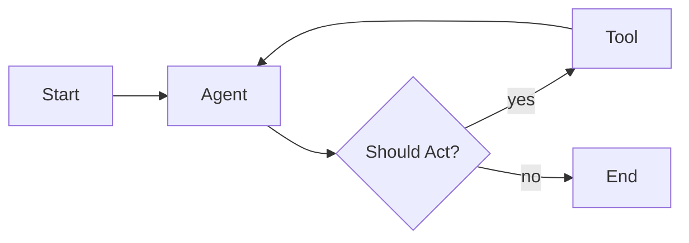

# Mastering LangGraph: Advanced Patterns for Stateful Multi-Agent Systems

While standard LangChain is excellent for linear DAGs (Directed Acyclic Graphs), real-world AI agents rarely move in a straight line. They need to retry, reflect, and loop back. This is where **LangGraph** enters the scene, providing a powerful framework for building stateful, multi-agent orchestrations with cycles.

## 1. The Core Primitive: `StateGraph`

In LangGraph, everything revolves around the `StateGraph`. Unlike a simple chain, a graph maintains a persistent state object that is passed between nodes and can be mutated according to predefined schema.

### Defining Your State
The State is the "source of truth." It's best defined using TypedDict or Pydantic.

```python
from typing import TypedDict, Annotated, List
from langgraph.graph import StateGraph, END

class AgentState(TypedDict):
    messages: Annotated[List[BaseMessage], add_messages]
    next_step: str
    is_finished: bool
```

## 2. Cyclic Workflows and Conditional Edges

Cycles are what make agents "smart." If an agent tool call fails, it should be able to look at the error and try a different approach.



In LangGraph, this is implemented using **Conditional Edges**:

```python
workflow.add_conditional_edges(
    "agent",
    should_continue,
    {
        "continue": "tools",
        "end": END
    }
)
```

## 3. Advanced Pattern: Reflection and Critique

One of the most powerful patterns in AI engineering is the **Reflection Loop**. Instead of accepting the first output, the graph routes the output to a "Critic" node which provides feedback, and then loops back to the "Generator" for improvement.

### Key Benefits:
- **Precision**: Drastically reduces hallucinations.
- **Consistency**: Ensures the output matches specific style or format requirements.
- **Complexity**: Allows the model to solve multi-stage reasoning tasks.

## 4. Human-in-the-Loop (HITL)

For high-stakes applications (e.g., code deployment or financial transactions), you don't want the agent to be 100% autonomous. LangGraph's **Checkpointing** and **Breakpoints** feature allows for seamless human oversight.

- **Breakpoints**: The graph pauses before/after a specific node and waits for an external "approval" signal.
- **Time Travel**: You can view previous states, modify them, and resume the graph from that point.

```python
# Pausing for human approval
workflow.compile(checkpointer=memory, interrupt_before=["execute_trade"])
```

## 5. Performance Optimization: Parallel Node Execution

LangGraph supports parallel execution natively. If your agent needs to fetch data from three different APIs, you can define them as independent nodes and LangGraph will execute them concurrently if there are no data dependencies between them.

## Best Practices for Senior Engineers

1. **State Immutability**: While the graph state is mutable, treat it as immutable within nodes. Always return a "delta" or a new version of the state rather than modifying it in place.
2. **Deterministic Routing**: Use LLMs to determine *intent*, but use deterministic logic to handle *routing* whenever possible.
3. **Graceful Degradation**: Always implement a `max_iterations` limit on cycles to prevent infinite loops (and infinite API bills).
4. **Comprehensive Logging**: Use **LangSmith** alongside LangGraph to visualize the trace of your state throughout the graph's execution.

## Conclusion

LangGraph isn't just a library; it's a mental model for building complex cognitive architectures. By mastering state management and cyclic patterns, we move from building simple chat bots to engineering robust AI systems that can reason, act, and learn from their mistakes.

---
*Dao Quang Truong is an Independent Researcher & Lead Developer focusing on Agentic AI frameworks. He is currently developing standardized multi-agent orchestration patterns.*
