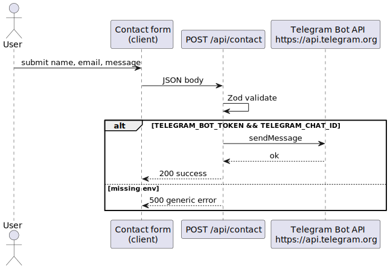

# Contact form → Telegram

The contact flow posts JSON to **`POST /api/contact`** (`src/pages/api/contact.ts`). The server validates input with **Zod**, then forwards the message to **Telegram** using the Bot API when credentials exist.

## Environment

- **`TELEGRAM_BOT_TOKEN`** — Bot token from [@BotFather](https://t.me/BotFather).
- **`TELEGRAM_CHAT_ID`** — Destination chat for inbound messages.

If either is missing, the handler logs server-side and returns a **generic** JSON error (no stack traces or internal paths to the client).

## Failure modes

- **400** — Validation failed (user-facing copy in response body).
- **500** — Missing configuration or Telegram transport failure; still generic externally.

## Diagram

Source: [`contact-telegram.puml`](./contact-telegram.puml)
