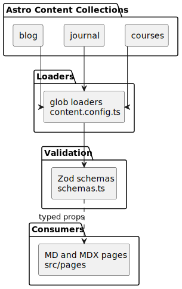

# Content collections (blog, journal, courses)

Markdown and MDX for the blog, journal, and course sections are loaded through **Astro Content Collections**: each collection uses a `glob` loader, shared **Zod** schemas for frontmatter, and feeds prerendered routes under `src/pages/`.

## Source of truth

- `src/content.config.ts` — defines `blog`, `journal`, and `courses` collections and wires loaders to `src/content/**`.
- `src/content/schemas.ts` — Zod schemas (`blogSchema`, `journalSchema`, `coursesSchema`) shared with validation scripts.
- Content directories: `src/content/blog/`, `src/content/journal/`, `src/content/courses/`.

## Diagram

Source (edit, then run `bun run docs:diagrams`): [`content-collections.puml`](./content-collections.puml)

Regenerate the diagram if collection names, loaders, or schema entry points change.
