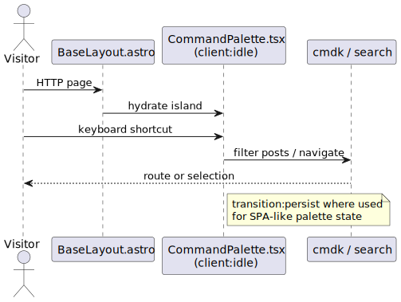

# Page shell, navigation, and command palette

The global chrome (header, nav, theme, SEO) lives in **`BaseLayout.astro`**. The **command palette** is a React island for quick navigation and in-site search, hydrated after idle load.

## Key files

- `src/layouts/BaseLayout.astro` — wraps most pages; imports shared UI and SEO.
- `src/components/CommandPalette.tsx` — client island (`client:idle`); receives post metadata for search; uses `cmdk`-style UX.

## Hydration

Using `client:idle` defers JS for the palette until the browser is idle, which keeps first paint fast on content-heavy pages.

## Diagram

Source: [`page-shell-navigation.puml`](./page-shell-navigation.puml)

Regenerate if layout composition or palette props change materially.
