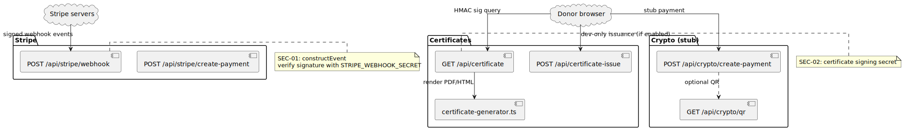

# Payments and certificates

This area covers **Stripe** webhooks and payment creation, **certificate** generation and verification, and **crypto** demo endpoints.

## Stripe

- **`POST /api/stripe/webhook`** — Verifies **`STRIPE_WEBHOOK_SECRET`** before handling events (`constructEvent`). See **SEC-01** in requirements traceability.
- **`POST /api/stripe/create-payment`** — Creates payment intents or mocks depending on env and policy (see data-layer phase for production honesty).

## Certificates

- **`GET /api/certificate`** — Serves or generates certificates only when requests include a valid **HMAC** (`CERTIFICATE_SIGNING_SECRET` / `sig` query). Implemented with `src/lib/certificate-generator.ts`. See **SEC-02**.
- **`POST /api/certificate-issue`** — Dev-oriented issuance path; gated from production behavior in code.

## Crypto (stub)

- **`/api/crypto/*`** — Stub/demo flows; do not treat as production treasury or custody. Align wording with [REPO_HYGIENE.md](../REPO_HYGIENE.md) and [CONCERNS.md](../../.planning/codebase/CONCERNS.md).

## Diagram

Source: [`payments-certificates.puml`](./payments-certificates.puml)
