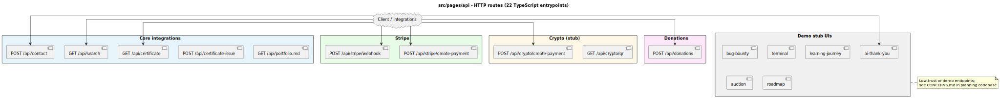

# Public API routes

Server routes live under `src/pages/api/` as **one file per HTTP handler** (Astro file-based API). There are **22** `.ts` entrypoints, grouped below by concern. Paths are the public URL prefix (no `.ts`).

## Route index (by cluster)

| Cluster | Example paths | Role |
|---------|-----------------|------|
| **Core / integrations** | `/api/contact`, `/api/search`, `/api/certificate`, `/api/certificate-issue`, `/api/portfolio.md` | Contact, semantic search, certificates, static portfolio export |
| **Stripe** | `/api/stripe/webhook`, `/api/stripe/create-payment` | Webhook verification and payment session creation |
| **Crypto (stub)** | `/api/crypto/create-payment`, `/api/crypto/qr` | Demo / stub flows — not production payment rails |
| **Donations** | `/api/donations` | Donation POST handler |
| **Demo / stub UIs** | `/api/ai-thank-you/*`, `/api/bug-bounty/*`, `/api/terminal/*`, `/api/learning-journey/*`, `/api/auction/*`, `/api/roadmap/*` | Experiments; treat as low-trust; many align with disabled `.astro` pages in `docs/REPO_HYGIENE.md` |

## Trust boundaries

- **Stub/demo** clusters are called out in [REPO_HYGIENE.md](../REPO_HYGIENE.md) for pages; API behavior and production suitability are summarized in [.planning/codebase/CONCERNS.md](../../.planning/codebase/CONCERNS.md).
- Regenerate the diagram if `src/pages/api/` gains or loses files.

## Diagram

Source: [`public-api-routes.puml`](./public-api-routes.puml)
