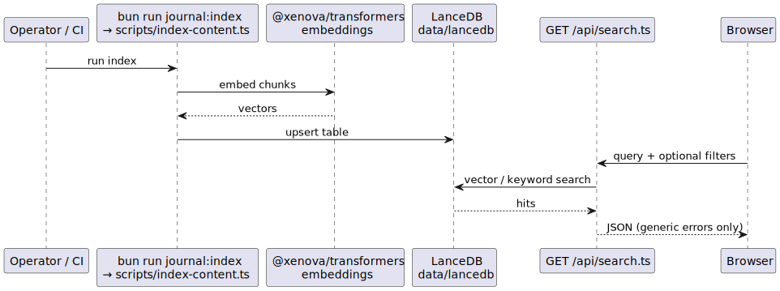

# Semantic search (LanceDB + embeddings)

The site can answer semantic queries over blog and journal content using **local LanceDB** storage and **on-the-fly embeddings** during indexing.

## Pipeline

1. **Index:** `bun run journal:index` (see `package.json`) runs **`scripts/index-content.ts`** (`journal:index` script), which reads Markdown under `src/content/blog` and `src/content/journal`, runs the **`@xenova/transformers`** embedding pipeline (`feature-extraction`, `Xenova/all-MiniLM-L6-v2`), and writes vectors to **`data/lancedb`** (gitignored; rebuild on each machine or deploy).
2. **Query:** **`search.ts`** (`src/pages/api/search.ts`) opens the same DB path and returns ranked results. Errors are **generic** to clients; details stay server-side (see Phase 3 hardening).

## Operations

- First index run downloads model weights — expect **cold start** latency and memory use locally.
- Production LanceDB path and pre-warming are called out in [.planning/codebase/CONCERNS.md](../../.planning/codebase/CONCERNS.md).

## Diagram

Source: [`semantic-search.puml`](./semantic-search.puml)

Regenerate if `index-content.ts`, embedding model, or API contract changes.
